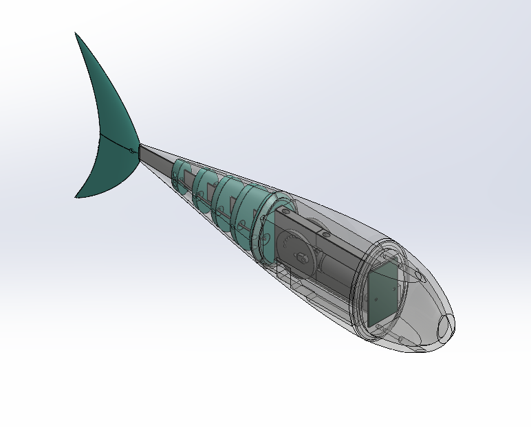
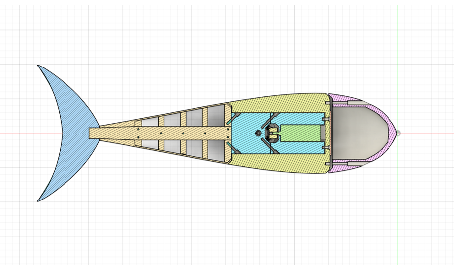
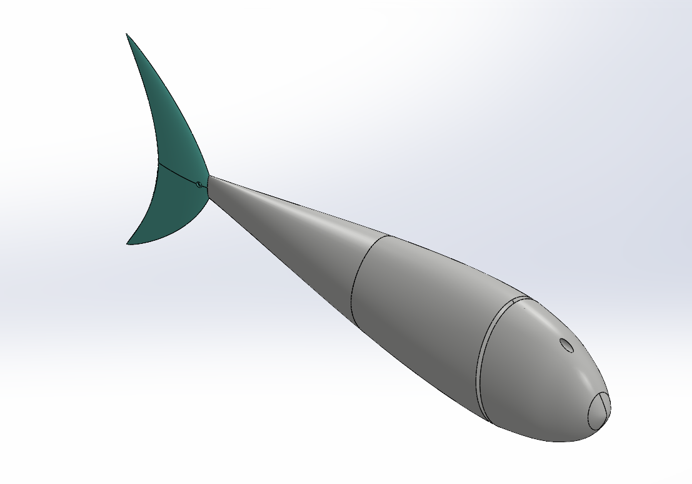
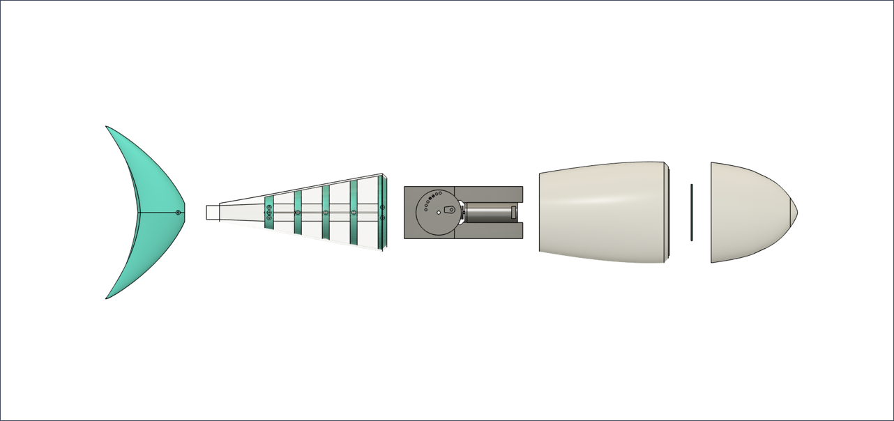
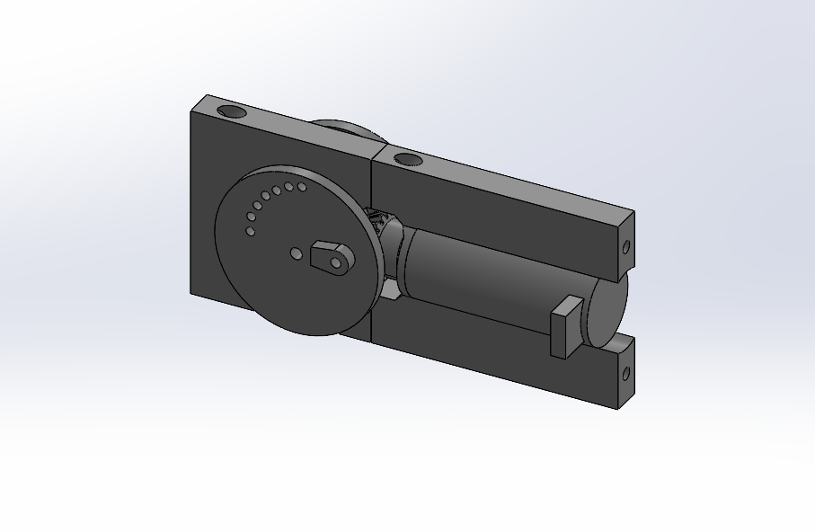
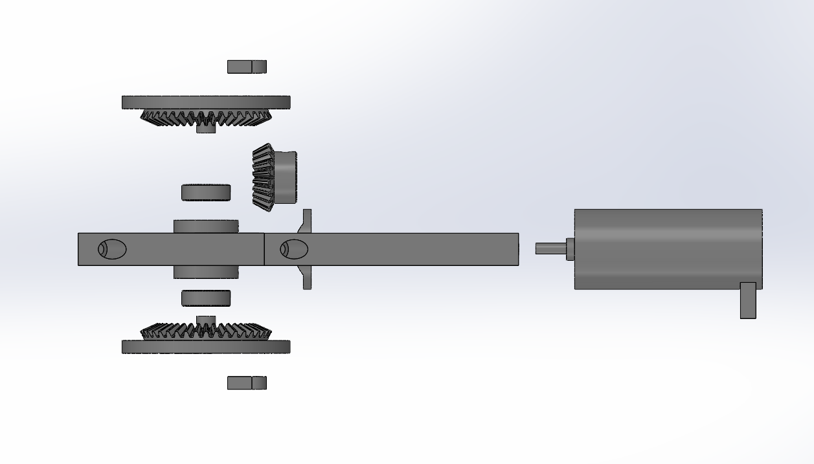
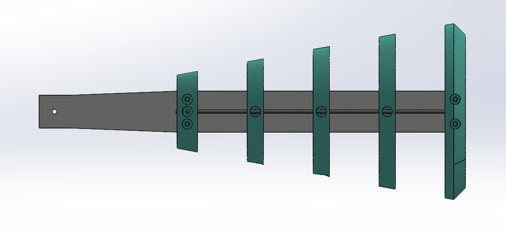
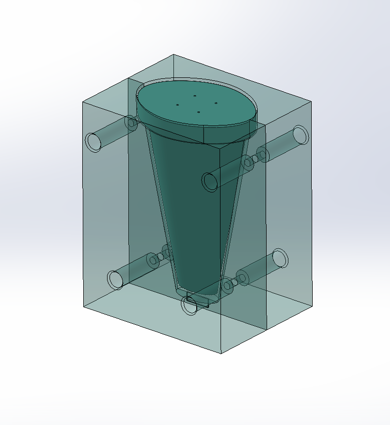

https://github.com/user-attachments/assets/9273b07a-2a17-41cb-9441-51ac28899b79

# Bio-Inspired Robotic Fish

## Overview

  

  

    
🔍 <b>Click to expand CAD Section & Internal Architecture View</b>

     
    

      
    

  

---

The Bio-Inspired Robotic Fish is an engineering project that uses undulatory propulsion (fish-like swimming) as an alternative to conventional propellers. The objective is to develop a modular robotic platform that mimics the biomechanics of carangiform swimmers using a mechanically actuated flexible body.

The project combines mechanism design, computational fluid dynamics (CFD), and rapid prototyping to integrate a rotary system that converts torque to smooth, oscillatory motion within a biomimetic frame. The project was developed as part of a physical prototyping class in which students designed and manufactured physical models for a speed competition.

---

## Project Objectives

The primary objectives of the project are to:

- Develop a mechanical system capable of converting a single rotary input into a traveling wave along a flexible body.
- Design a hydrodynamically efficient external body inspired by biological swimmers.
- Create a modular internal architecture that supports rapid iteration of actuators and transmission mechanisms.
- Evaluate propulsion concepts through physical prototyping.

---

## Problem Description

Conventional underwater vehicles primarily rely on propellers for propulsion. While effective, propellers generate noise, expose moving components, and are not optimized for maneuverability in confined or sensitive environments.

Many aquatic organisms instead produce propulsion by generating traveling waves along their bodies and fins. This method provides efficient thrust generation while enabling precise maneuvering and reduced acoustic signature.

This project explores the engineering challenges associated with reproducing this biological locomotion using practical mechanical systems and accessible manufacturing techniques. 

---

## Exterior Design

The external body is designed to balance hydrodynamic performance, manufacturability, and accessibility to internal components. Multiple design iterations are evaluated using CAD modeling and Computational Fluid Dynamics (CFD) to investigate body shape, drag characteristics, and flow behavior before fabrication.

Design considerations include:

- Streamlined body geometry
- Hydrodynamic efficiency
- Internal packaging volume
- Modular outer shell construction
- Ease of assembly and maintenance

CFD analysis was used during the design process to compare body geometries. Specific attention was given to drag coefficients when examining mechanisms to improve swimming velocity. Detailed CFD setup, mesh generation, and results are available in the analysis report:

[CFD Analysis Report](Analysis/CFD_report.pdf)

Shown in **Figure 1** is the final external design, which was modified from the surface model with the lowest drag coefficient and modularized into three compartments. Each compartment houses the electronics, the rotary actuator, and the spine used to generate the oscillation, respectively. 

---

## Interior Design

The internal mechanical architecture focuses on generating undulatory motion using a compact rotary actuator and transmission mechanism. This design uses continuous rotary motion to produce a controlled traveling wave capable of propagating through a compliant tail section.

Current design investigations include:

- Motion transmission mechanisms
- Linkage geometry optimization
- Flexible body integration
- Waterproof packaging strategy

**Figure 2** displays the complete internal architecture, which is divided into three functional modules:

- *Module 1 (Front):* Houses the main electronics and battery payload. A secure gasket seals the interface between the first and second modules.

- *Module 2 (Central):* Encloses the motor gearbox and features integrated negative space for custom buoyancy weighting.

- *Module 3 (Rear):* Consists of the main undulating spine enclosed in a compliant silicone sleeve.

The gearbox mounts directly to the largest node of the spine, allowing the entire drive sub-assembly to slide seamlessly into the central chassis. Fastening the gearbox to the forward wall of Module 2 compresses the silicone sleeve, establishing a robust, watertight seal between the drive and tail sections.

**Figure 3** illustrates the internal drive system, which is engineered to generate reciprocating motion that mimics the tandem contraction and expansion of biological fish musculature.

- *Torque Transmission:* A central drive gear translates power to two counter-rotating flywheels to balance inertial forces.

- *Adjustable Amplitude:* Multiple pinholes are integrated into the flywheels to allow for rapid physical experimentation with different oscillatory wave heights.

  
🔍 <b>Exploded View</b>

  

    
  

**Figure 4** illustrates the spine system, which translates the rotational crank motion of the flywheels into the undulating wave profile that drives the tail fin. A flexible spine runs through five distinct nodes, which are linked to the flywheels via rigid PLA shafts. These push-pull linkages offer significantly higher structural rigidity and more precise force transmission than traditional steel cables or high-tensile ropes.

---

## Manufacturing

The robotic fish is designed around rapid prototyping techniques that enable fast design iteration while minimizing manufacturing cost and complexity.

### Pirmary Fabrication

**3D Printing:** 
- The main chassis modules
- The gear housings and components
-  Modular spine nodes
Components are designed with targeted orientation optimization to maximize layer adhesion against cyclic shear stresses generated during undulatory swimming.

**Laser Cutting:**
The central structural spine is precision laser-cut from acrylic sheets. This provides the bending stiffness required to guide the wave profile while maintaining structural rigidity.

**Silicone Molding:**
**Figure 5** illustrates the multi-part mold designed in SOLIDWORKS and 3D-printed to form the soft robotic component. A silicon epoxy is cast within the mold to produce the compliant outer casing required to seal the spine.

---

## Prototype Demonstration

The prototype was evaluated multiple times to optimize buoyancy and wave amplitude. **Figure 6** is a video log of a velocity test.

<!-- Insert demonstration video here -->
<video src="Media/Prototype_Demo.mp4" width="100%" controls></video>

---

## Skills Demonstrated

### Mechanical Design

- CAD modeling and assembly design
- Mechanical packaging
- Biomimetic engineering
- Actuator Integration
- Computational Fluid Dynamics (ANSYS Fluent)

### Manufacturing

- Design for additive manufacturing
- Laser-cut component
- Silicone molding
- Rapid prototyping

### Engineering Tools

- SolidWorks
- ANSYS Fluent
- 3D Printing
- Laser Cutting

---

## Acknowledgments

This project was completed as part of a robotics design course at Purdue University under the guidance of **Prof. Rob Scharff**.

Special thanks to the project team for their contributions:

- **Prof. Rob Scharff** – Project advisor and course instructor.
- **Artur Zhang** – Electrical Systems Lead, responsible for the electrical architecture and hardware integration.
- **Jonathan Wu** – Actuation Systems Lead, responsible for the development of the actuation subsystem and motion generation concepts.

Unless otherwise noted, the mechanical system design, CAD development, manufacturing strategy, engineering analysis, and project documentation presented in this repository represent my individual contributions. Team members are credited within specific files and documentation where they made direct contributions.
